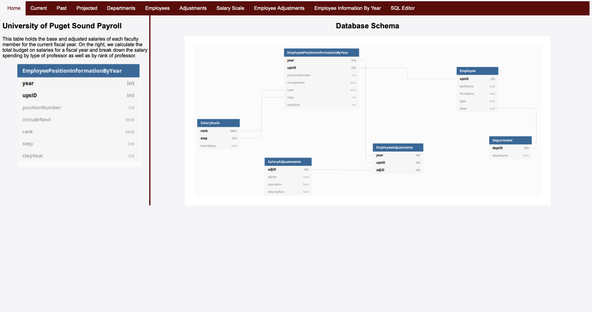
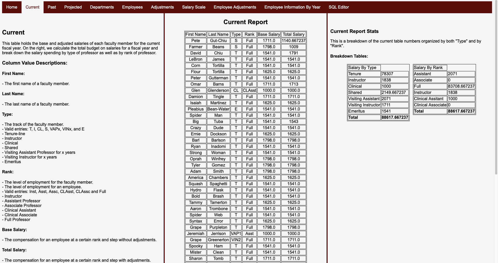
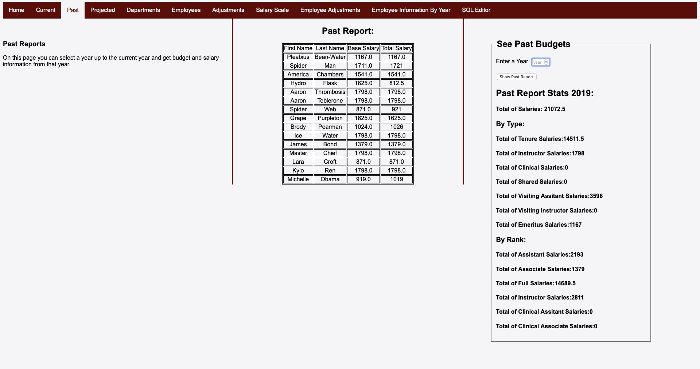
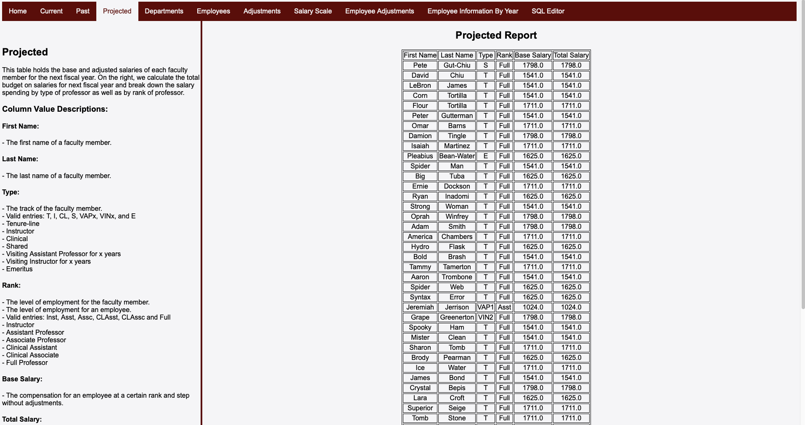
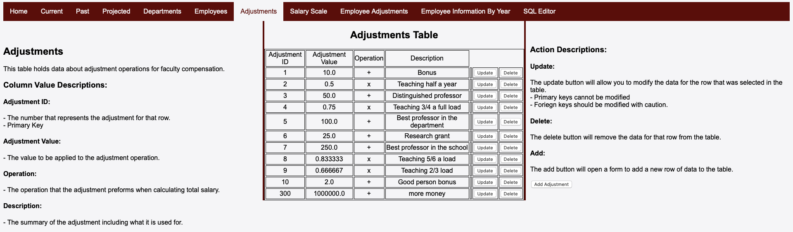
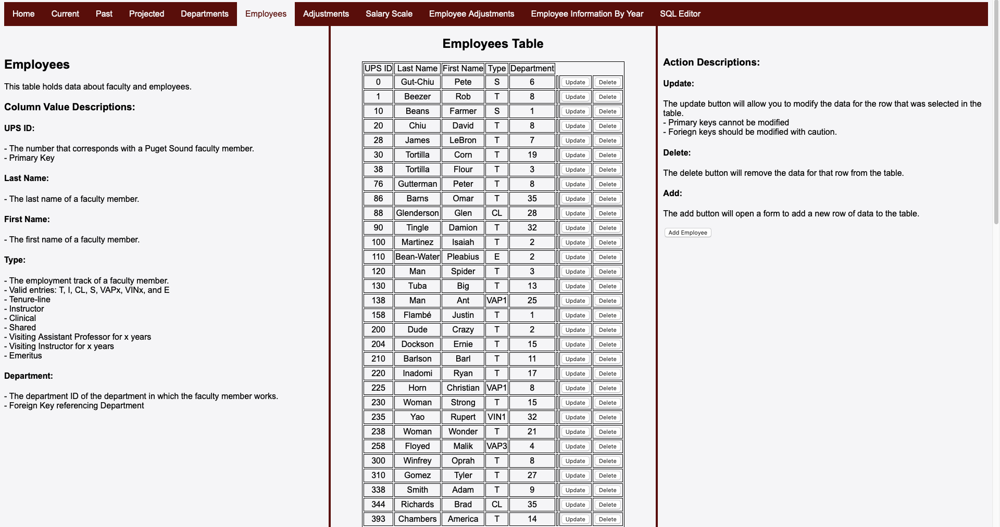
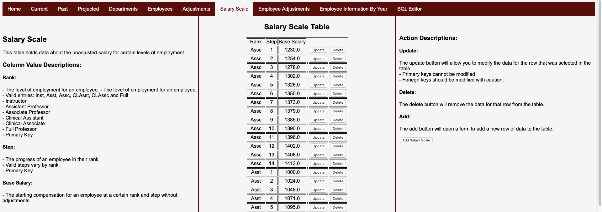
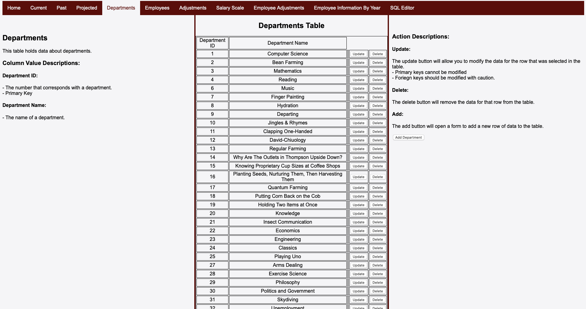
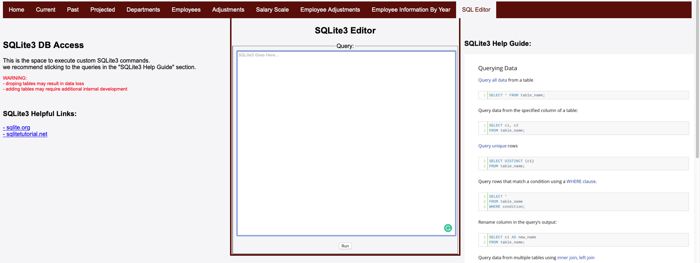

This faculty compensation management site was developed by a team of 3 individuals. Our client was a University of Puget Sound mathematics professor responsible for keeping records on faculty compensation. During and shortly after development, the site was publicly available on a server running Apache. However, to run this site yourself:
* Make sure you have PHP installed. For more resources on how to install PHP, visit https://www.php.net/manual/en/install.php.
* Start a development server on php -S localhost:8000
* Visit localhost:8000 in your web browser.

## This is the homepage, showing the database schema: 

Total compensation for each professor is calculated by
* Base Salary
* Salary Adjustments
The base salary is defined by a rank (Full, Assistant, Associate, etc.) and a step (a number associated with the amount of time spent in a particular rank). 

Each professor has specific adjustments affecting the base salary. For example, a professor may only teach 5 classes (6 classes is considered a full load), so they would make 5/6 of their original salary. 

The below photos are demonstrations for the features of the site.

## Current Salary Reports

## Past Salary Reports For Specific Year

## Projected Report for the Next Year 

Predictive report generated by incrementing ranks and steps for professors appropriately.

## Page to Add Commonly Used Salary Adjustments

## View, Add, and Edit Current Employees

## View, Add, and Edit Base Salaries

## Manage School Departments

## Built In SQL Editor

Our client expressed interest in learning SQL himself, so the team decided to include a built in SQL editor for direct database access.

